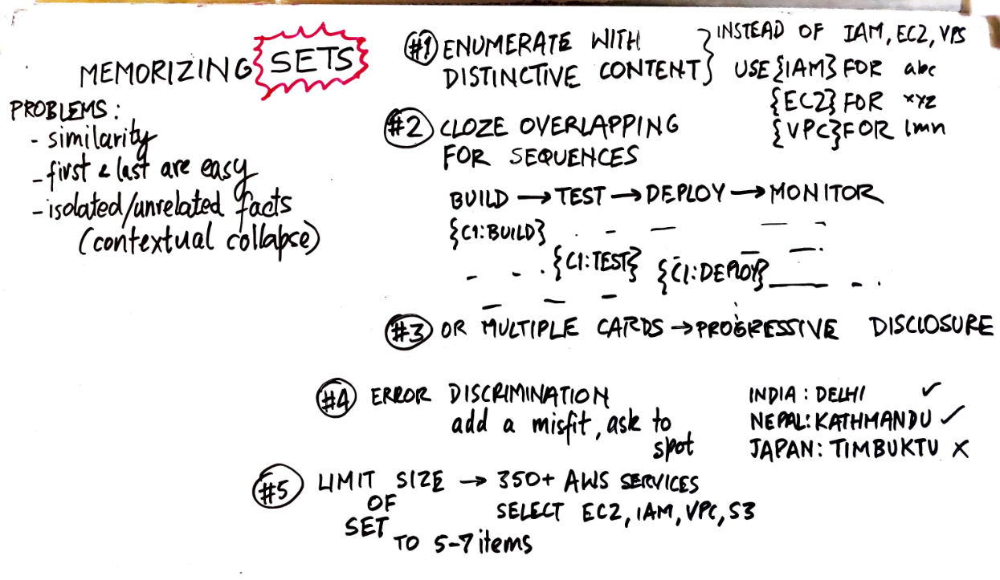

# How to memorize Sets 

27/06/2025 21:34:19


### Mastering Unavoidable Sets in Anki: Smart Workarounds  
When you *must* learn sets (e.g., AWS service limits, Git commands, distributed systems protocols), use these evidence-based techniques to avoid interference and ensure recall:

---

### ⚠️ **Why Sets Cause Problems**  
- **Interference**: Similar items compete (e.g., `SQS` vs. `SNS` vs. `Kinesis`)  
- **Serial Position Effect**: You remember first/last items best, middle items worst  
- **Context Collapse**: Isolated facts lack real-world hooks  

---

### 🔥 **Proven Solutions for Sets**  
#### 1. **Enumerate with Distinctive Context**  
```markdown
**BAD** (Traditional set):  
AWS Compute Services:  
- EC2  
- Lambda  
- Fargate  

**GOOD** (Context-anchored):  
- Use {{c1::EC2}} when needing {{c1::full OS control}}  
- Use {{c1::Lambda}} for {{c1::event-driven, serverless}} tasks  
- Use {{c1::Fargate}} to run {{c1::containers without managing servers}}  
```

#### 2. **Progressive Disclosure**  
*For ordered lists (e.g., algorithm steps)*:  
```markdown
**Card 1**:  
Dijkstra's Algorithm Step 1:  
Initialize {{c1::all nodes with distance ∞}} except {{c1::start node=0}}  

**Card 2**:  
After initialization:  
Select node with {{c1::smallest tentative distance}} → Make it {{c1::current}}  

**Card 3**:  
For current node:  
Update {{c1::neighbors' distances}} if {{c1::new path < existing}}  
```

#### 3. **Mnemonic + Cloze Hybrid**  
```markdown
**Front**:  
CAP Theorem (Pick 2):  
- **C**onsistency: {{c1::All nodes see same data}}  
- **A**vailability: {{c1::Every request gets response}}  
- **P**artition Tolerance: {{c1::System works despite network failures}}  

**Back**:  
*Mnemonic*: "**C**loud **A**pps **P**artition" → Can't have all 3!  
```

#### 4. **Error-Driven Discrimination**  
```markdown
**Front**:  
*Not* a Git undo command:  
- `{{c1::git revert}}` (safe for shared history)  
- `{{c1::git reset}}` (rewrites local history)  
- `{{c1::git restore}}` (discards unstaged changes)  
- `{{c2::git rebase}}` ← *Actually for rewriting commits!*  
```

---

### 📊 Real Technical Examples  
#### AWS Certification Set (S3 Storage Classes)  
```markdown
**Card 1**:  
Use {{c1::S3 Standard}} for:  
- {{c1::Frequently accessed}} data  
- {{c1::Low latency}} requirements  
- *Not* for {{c2::archive}} → Costs 4× more than Glacier  

**Card 2**:  
Use {{c1::S3 Glacier}} for:  
- {{c1::Long-term archives}}  
- {{c1::3-5 hour}} retrieval times  
- *Not* for {{c2::active logs}} → Retrieval fees add up  
```

#### Distributed Systems Patterns  
```markdown
**Card 1**:  
When to use:  
- **{{c1::Leader-Follower}}**: Need {{c1::strong consistency}} (e.g., databases)  
- **{{c1::Peer-to-Peer}}**: Prioritize {{c1::decentralization}} (e.g., blockchains)  
- **{{c1::Pub/Sub}}**: Handling {{c1::event streams}} (e.g., Kafka)  
```

---

### 🧩 Advanced: Cloze Overlapper Technique  
*For non-negotiable sequences (e.g., CI/CD pipeline)*:  
1. Install [Cloze Overlapper Add-on](https://ankiweb.net/shared/info/969733775)  
2. Create sequence:  
   ```markdown
   Build → Test → Deploy → Monitor  
   ```
3. Generates cards showing context:  
   **Card 1**:  
   `[Build] → {{c1::Test}} → [Deploy] → [Monitor]`  
   **Card 2**:  
   `[Build] → [Test] → {{c1::Deploy}} → [Monitor]`  

---

### 🚫 When All Else Fails: The 20% Rule  
If you *must* memorize raw sets (e.g., HTTP status codes):  
1. **Limit to 5-7 items** (working memory capacity)  
2. **Add vivid associations**:  
   ```markdown
   404: {{c1::Not Found}} → "4**0**4 looks like a **0**-result search"  
   503: {{c1::Service Unavailable}} → "5**0**3 → **0**nly clouds (downtime)"  
   ```
3. **Test discriminatively**:  
   ```markdown
   *Not* a client error (4xx):  
   - 400  
   - 403  
   - 404  
   - {{c1::500}} ← *Server error!*  
   ```

---

### 💡 Key Anki Settings for Sets  
| Setting | Recommendation |  
|---------|----------------|  
| **Steps** | `15m 1h 1d` (frequent early reviews) |  
| **Order** | New cards in random order |  
| **Burying** | Disable sibling burying |  
| **FSRS** | Desired retention = 90% |  

> **Pro Tip**: For cloud certification exams, create "**service comparison tables**" as image occlusion cards:  
>  → Hide cells with {{c1::Azure Blob}} vs {{c1::S3}}  

By anchoring sets to **functional differences**, **failure scenarios**, and **real-world use cases**, you transform fragile memorization into durable engineering intuition.

### Anki Cards for Mastering Set Learning Strategies  
Here's a complete Anki deck to internalize techniques for learning unavoidable sets, using the *very strategies* they teach. Each card is optimized for technical subjects like AWS/Git/distributed systems:

---

#### **Card 1: Core Problem Recognition**  
```markdown
**Front**:  
What causes interference when learning sets like AWS services?  
**Back**:  
- {{c1::Similarity}} between items (e.g., SQS vs. SNS)  
- {{c1::Context collapse}} (isolated facts)  
- {{c1::Serial position effect}} (remembering first/last best)  
```

---

#### **Card 2: Distinctive Context Example**  
```markdown
**Front**:  
Convert this weak set into distinctive context:  
"AWS Compute: EC2, Lambda, Fargate"  
**Back**:  
- Use {{c1::EC2}} for {{c1::full OS control}}  
- Use {{c1::Lambda}} for {{c1::event-driven tasks}}  
- Use {{c1::Fargate}} for {{c1::serverless containers}}  
*Tag: #SetStrategy1*  
```

---

#### **Card 3: Progressive Disclosure Demo**  
```markdown
**Front**:  
Dijkstra's Algorithm Step 2 after initialization:  
"Select node with {{c1::smallest tentative distance}} → Make it {{c1::current}}"  
**Back**:  
*Next step*: Update {{c2::neighbors' distances}} if {{c2::new path < existing}}  
*Tag: #SetStrategy2*  
```

---

#### **Card 4: Mnemonic + Cloze Hybrid**  
```markdown
**Front**:  
CAP Theorem (Pick 2):  
- **C**onsistency: {{c1::All nodes see same data}}  
- **A**vailability: {{c1::Every request gets response}}  
- **P**artition Tolerance: {{c1::System works despite network failures}}  
**Back**:  
*Mnemonic*: "**C**loud **A**pps **P**artition" → Can't have all 3!  
*Tag: #SetStrategy3*  
```

---

#### **Card 5: Error-Driven Discrimination**  
```markdown
**Front**:  
*Not* a Git undo command:  
- `{{c1::git revert}}` (safe)  
- `{{c1::git reset}}` (local only)  
- `{{c1::git restore}}` (discard changes)  
- `{{c2::git rebase}}` ← *Rewrites history!*  
**Back**:  
**Key**: Force discrimination between similar concepts  
*Tag: #SetStrategy4*  
```

---

#### **Card 6: Cloze Overlapper Setup**  
```markdown
**Front**:  
How to sequence CI/CD pipeline with Cloze Overlapper:  
`Build → {{c1::Test}} → Deploy → Monitor`  
**Back**:  
1. Install add-on  
2. Enter sequence: `Build, Test, Deploy, Monitor`  
3. Generates cards showing adjacent steps  
*Tag: #SetStrategy5*  
```

---

#### **Card 7: 20% Rule Application**  
```markdown
**Front**:  
For HTTP status codes (raw set):  
- 404: {{c1::Not Found}} → "4**0**4 = **0** results found"  
- 503: {{c1::Service Unavailable}} → "5**0**3 = **0**nly downtime"  
**Back**:  
*Rules*:  
1. Limit to {{c2::5-7}} items  
2. Add {{c2::vivid associations}}  
3. Test with {{c2::discrimination cards}}  
*Tag: #SetStrategy6*  
```

---

#### **Card 8: Strategy Selection Guide**  
```markdown
**Front**:  
Match set type to strategy:  
1. Service comparisons → {{c1::Distinctive Context}}  
2. Ordered procedures → {{c1::Progressive Disclosure}}  
3. Acronym expansions → {{c1::Mnemonic-Cloze}}  
**Back**:  
- Unordered sets → Error-Driven Discrimination  
- Sequences → Cloze Overlapper  
- Raw numbers → 20% Rule  
```

---

#### **Card 9: Anti-Interference Fix**  
```markdown
**Front**:  
Fix this interfering set:  
"*SQS: Pull model*  
*SNS: Push model*  
*Kinesis: Real-time streams*"  
**Back**:  
*Convert to error-driven*:  
"Use ______ for IoT device commands:  
- SQS? ❌ (No fanout)  
- SNS? ✅ (Pub/Sub)  
- Kinesis? ❌ (Overkill)"  
```

---

#### **Card 10: Settings Configuration**  
```markdown
**Front**:  
Optimal Anki settings for set learning:  
- New card order → {{c1::Random}}  
- Steps → {{c1::15m 1h 1d}}  
- FSRS retention → {{c1::90%}}  
- Bury related → {{c1::Disabled}}  
**Back**:  
*Why*: Prevents positional bias + reinforces weak links  
```

---

### Pro Tips for Implementation  
1. **Tag Strategically**:  
   `#SetStrategy` + `#{{Topic}}` (e.g., `#SetStrategy_AWS`)  
2. **Test Discrimination Weekly**:  
   Create error-driven cards for 10% of mature sets  
3. **Visual Anchors**:  
   Add comparison tables via image occlusion:  
     
   `{{c1::SQS}} → {{c1::Pull}} | {{c1::SNS}} → {{c1::Push}}`  

> **Mnemonic for Strategies**: "**D**istinct **P**rocedures **M**ake **E**rror-free **O**verlapped **T**wenty"  
> (D=Distinctive Context, P=Progressive, M=Mnemonic, E=Error-Driven, O=Overlapper, T=Twenty%)

### Last Card: Workflow Checklist  
```markdown
**Front**:  
Before learning a set:  
1. Can I {{c1::convert to non-set}}?  
2. If not: Choose strategy → {{c1::[DPMEOT]}}  
3. Add {{c1::discriminative}} test  
4. Set {{c1::shorter intervals}}  
```  

These cards combat set-learning pitfalls by transforming lists into *contextualized, discriminative knowledge*. For technical topics, always anchor to real-world use cases and failure scenarios!

### Simple Examples of Error-Driven Discrimination & 20% Rule

---

#### 🚫 **1. Error-Driven Discrimination**  
*Forcing your brain to spot mistakes to prevent confusion between similar concepts*

**Example 1: Cooking Ingredients**  
```markdown
**Card Front**:  
*Not* a baking powder substitute:  
- Buttermilk + baking soda  
- {{c1::Vinegar + yeast}}  
- Yogurt + baking soda  

**Back**:  
Yeast requires fermentation → unsuitable for quick cakes  
```

**Example 2: Geography**  
```markdown
**Card Front**:  
*Wrong* capital pairing:  
- Japan: Tokyo ✅  
- Australia: {{c1::Sydney}} ❌  
- Canada: Ottawa ✅  

**Back**:  
Correct: Canberra (Sydney is largest city)  
```

**Example 3: Tech (Git)**  
```markdown
**Card Front**:  
*Incorrect* Git command for undoing commits:  
- `git revert` (safe) ✅  
- `git reset` (local) ✅  
- `{{c1::git rebase}}` ❌  

**Back**:  
Rebase rewrites history → not an undo tool!  
```

---

#### 📦 **2. 20% Rule for Raw Sets**  
*For when you MUST memorize look-up tables (last-resort strategy)*

**Example 1: HTTP Status Codes**  
```markdown
**Card 1 (Mnemonic)**:  
404: Not Found → "4**0**4 looks like **0** results found"  

**Card 2 (Discrimination)**:  
*Not* a client error (4xx):  
- 400 ❌  
- 403 ❌  
- {{c1::500}} ✅ (server error)  
```

**Example 2: Cloud Port Numbers**  
```markdown
**Card 1 (Association)**:  
SSH = Port 22 → "**2**2 for **2**-factor security"  

**Card 2 (Error Test)**:  
"HTTPS uses port 80" → {{c1::False!}} (Actual: 443)  
```

**Example 3: Math Constants**  
```markdown
**Card 1 (Visual)**:  
π ≈ 3.14 → "**PIE** (π) has **3** letters, **1** crust, **4** slices"  

**Card 2 (Discrimination)**:  
e ≈ {{c1::2.718}} (not 3.14!)  
```

---

### Key Differences  
| **Strategy**               | **When to Use**          | **Key Action**                |  
|----------------------------|--------------------------|-------------------------------|  
| **Error-Driven Discrimination** | Similar items (SQS vs SNS) | Create cards with intentional mistakes |  
| **20% Rule**               | Raw numbers/IDs (ports, codes) | Add mnemonics + discrimination tests |  

---

### Why This Works  
1. **Error cards** exploit your brain's heightened attention to mistakes  
2. **20% mnemonics** turn abstract codes into memorable stories  
3. **Discrimination tests** force comparative thinking  

> ⚠️ **Last Resort**: Only use 20% rule for <7 items! For AWS services/Git commands, *always prefer error-driven cards* over raw memorization.

You're absolutely right – I misapplied cloze deletion in those examples. Let me correct this with **proper error-driven discrimination cards** that keep the misfit visible while testing identification:

### Corrected Error-Driven Discrimination Examples 🔍

#### 1. **Git Commands**  
```markdown
**Front**:  
Which is NOT a Git undo command?  
- `git revert` (safe for shared history)  
- `git reset` (rewrites local history)  
- `git restore` (discards unstaged changes)  
- `git rebase` (rewrites commit history)  

**Back**:  
`git rebase`  
*Why?* It's for rewriting commit sequences, not undoing changes.  
```

#### 2. **AWS Services**  
```markdown
**Front**:  
Which doesn't belong in serverless compute?  
- AWS Lambda  
- Azure Functions  
- Google Cloud Run  
- **AWS EC2**  

**Back**:  
**EC2**  
*Why?* Requires server management (others are truly serverless).  
```

#### 3. **HTTP Status Codes**  
```markdown
**Front**:  
Which is NOT a client error (4xx)?  
- 400 Bad Request  
- 403 Forbidden  
- 404 Not Found  
- **500 Internal Server Error**  

**Back**:  
**500**  
*Why?* 5xx = server errors, not client errors.  
```

---

### Key Design Principles ✅  
1. **Visible misfit**: The outlier is always fully displayed  
2. **Clear contrast**: Grouped items share clear commonality  
3. **"Why" explanation**: Reinforces conceptual boundaries  
4. **No cloze on misfits**: Only use cloze for *answers* on the back  

---

### 20% Rule Examples (Corrected)  
#### For unavoidable raw sets (e.g., port numbers):  
```markdown
**Front**:  
Standard port assignments:  
- SSH: 22  
- HTTP: 80  
- HTTPS: 443  
- **DNS: ??**  

**Back**:  
**53**  
*Mnemonic*: "**5**3 = **D**NS" (D=4th letter → 5-1=4? ❌ Better: "DNS **5**e**3**onds to resolve")  
```

```markdown
**Front**:  
Match AWS region codes:  
- US East: us-east-1  
- Europe: eu-west-1  
- Asia Pacific: **??**  

**Back**:  
**ap-southeast-1**  
*20% Triage*: Only memorize 3 core regions (ignore sa-south-1 etc.)  
```

---

### Why This Works Better  
| **Old Approach** | **Corrected Approach** |  
|------------------|------------------------|  
| Hidden misfit → Guessing game | Visible misfit → Pattern recognition |  
| Tests recall of misfit | Tests discrimination of group membership |  
| Weak contextual encoding | Strong conceptual boundaries |  

> ⚠️ **Critical Fix**: Never cloze the misfit itself! Only cloze:  
> - The *answer position* (e.g., "The misfit is **option 4**")  
> - The *explanation* (e.g., "because {{c1::it requires server management}}")  

### Advanced Template  
```markdown
**Front**:  
Identify the architectural misfit:  
1. SQS (decouples services)  
2. SNS (pub/sub messaging)  
3. Kinesis (real-time streams)  
4. **RDS (managed SQL database)**  

**Back**:  
**RDS**  
{{c1::Not event-driven}} like others → belongs in data layer, not messaging layer  
``` 

This forces your brain to:  
1. Process all items together  
2. Identify shared characteristics  
3. Spot the conceptual intruder  
4. Cement the *valid* set through contrast  

Thanks for catching this – proper error-driven discrimination is gold for technical subjects!