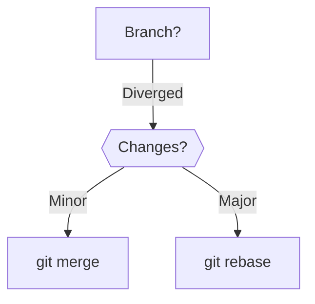

# Hybrid Cloze Types

27/06/2025 20:40:09

### Hybrid Cloze Made Simple 🧩  
**Hybrid Cloze = Combining *different cloze types* in one card to test multiple skills at once.**  
Think of it like a "combo meal" for your brain – instead of just fries (facts), you get fries + burger + drink (facts + concepts + visuals).  

---

### Easy Examples 🍎  

#### 1. **Cloze + Image Occlusion**  
*Learning: Parts of a computer*  
```markdown
**Front**:  
[Image of computer with boxes over parts]  
1. Pointing device: {{c1::mouse}}  
2. {{c2::CPU}} does calculations (click image)  
```  
- **What you do**:  
  1. Type "mouse" for blank 1  
  2. *Click image* → box reveals "CPU" under mark  
- **Tests**: Fact recall + visual identification  

---

#### 2. **Cloze + Multiple Choice**  
*Learning: Math operations*  
```markdown
**Front**:  
Solve: 8 {{c1::×}} 3 = 24  
This operation is called:  
a) Addition  
b) {{c1::Multiplication}}  
c) Subtraction  
```  
- **What you do**:  
  1. Type "×" for symbol  
  2. Select "Multiplication"  
- **Tests**: Symbol recall + concept understanding  

---

#### 3. **Cloze + True/False**  
*Learning: Animals*  
```markdown
**Front**:  
A {{c1::bat}} is a mammal.  
True/False? {{c1::True}}  
*Why? {{c2::It feeds milk to babies}}  
```  
- **What you do**:  
  1. Type "bat"  
  2. Select "True"  
  3. Explain reason  
- **Tests**: Fact + reasoning + exception knowledge  

---

### Real-Life Hybrids 🚗  

#### Example 1: Learning Driving Rules  
```markdown
**Front**:  
[Photo intersection with box over sign]  
At {{c1::red light}} → {{c1::STOP}} (click sign)  
Unless turning right? {{c2::Yes}} (if allowed)  
```  

#### Example 2: Cooking Instruction  
```markdown
**Front**:  
Making scrambled eggs:  
1. Crack {{c1::2 eggs}} into bowl  
2. Add {{c1::salt}} and {{c1::pepper}}  
3. Cook until {{c2::creamy}} (not rubbery!)  
```  

---

### Why Hybrids Work Better  
| **Standard Cloze**          | **Hybrid Cloze**               |  
|-----------------------------|--------------------------------|  
| "France capital = {{c1::Paris}}" | "France: Capital is {{c1::Paris}} (Flag: 🇫🇷 | Language: {{c2::French}})" |  
| *Tests isolated fact*       | *Tests fact + associations*    |  

---

### How to Create Hybrid Cards  
1. **Start simple**:  
   ```markdown
   Apple color: {{c1::red}}  
   Tastes: {{c1::sweet}}  
   [Image: 🍎]  
   ```
2. **Add layers**:  
   ```markdown
   Chemical making apples red: {{c2::anthocyanin}}  
   (Hint: {{c1::Same pigment in purple grapes}})  
   ```

3. **Use free add-ons**:  
   - **Image Occlusion**: Hide parts of pictures  
   - **Cloze Overlapper**: Handle complex sequences  

> ⏱️ **Pro Tip**: Hybrid cards take 20% longer to make but save 40% review time by preventing fragmented knowledge!

### Hybrid = Deeper Understanding  
While normal cloze asks: *"What's this?"*  
Hybrid cloze asks:  
1. *"What's this?"*  
2. *"How does it connect?"*  
3. *"When would I use it?"*  
All in one card! 🚀


### Hybrid Cloze Types: Power Combinatons for Technical Mastery  
Hybrid clozes merge *multiple cloze techniques* in one card to test **interconnected knowledge dimensions** - ideal for complex technical subjects like Git, AWS, and distributed systems. Below are battle-tested formulas with real examples:

---

### 1. **Cloze Chain + Image Occlusion**  
**Formula**: `Step-by-step workflow` + `Diagram annotation`  
**Use Case**: AWS/Git workflows, distributed algorithms  
```markdown
**Front**:  
  
1. `git {{c1::rebase main}}` → Integrates main branch  
2. Resolve {{c2::conflicts}} in {{c3::<<1>>}} (click image)  
3. `git {{c1::rebase --continue}}`  
```  
*Image Occlusion Hotspot*:  
- Marker 1: Feature branch commits  
- Marker 2: Conflict markers in code  

**Why Hybrid?**: Combines **syntax recall** (CLI) + **spatial understanding** (workflow visualization).

---

### 2. **Error-Driven + Contextual Cloze**  
**Formula**: `Failure scenario` + `Debugging steps`  
**Use Case**: Cloud troubleshooting, system failures  
```markdown
**Front**:  
CloudFormation stack fails with `ROLLBACK_COMPLETE`:  
- Symptom: `Resource creation cancelled`  
- Cause: Missing {{c1::IAM::Permissions}} for `{{c1::AWS::EC2::Instance}}`  
- Fix: Add `{{c2::s3:GetObject}}` to role policy  
```  
**Back**:  
```yaml
# Policy snippet:  
Effect: Allow  
Action: {{c1::s3:GetObject}}  
Resource: arn:aws:s3:::{{c1::config-bucket}}/*  
```

**Why Hybrid?**: Tests **diagnostic logic** + **exact syntax** in failure context.

---

### 3. **Contrast Cloze + Concept Mapping**  
**Formula**: `Compare alternatives` + `Decision triggers`  
**Use Case**: Architecture trade-offs, service selection  
```markdown
**Front**:  
Choose between SQS ({{c1::pull}}) vs. Kafka ({{c1::pub/sub}}) for:  
- {{c2::Order processing}}: Requires {{c1::exactly-once}} delivery → {{c1::Kafka}}  
- {{c2::Notification fanout}}: Needs {{c1::horizontal scaling}} → {{c1::SQS+SNS}}  
```  
*Visual*:  
```mermaid
graph LR
  App-->|Orders| {{c1::Kafka}}
  App-->|Alerts| {{c1::SQS}}
```

**Why Hybrid?**: Forces **comparative reasoning** + **service differentiation**.

---

### 4. **Code Cloze + Architecture Link**  
**Formula**: `Snippet annotation` + `System impact`  
**Use Case**: Code reviews, infrastructure-as-code  
```python
**Front**:  
# AWS Lambda: Process S3 upload  
def lambda_handler(event, context):  
    bucket = event['Records'][0]['s3']['bucket']['{{c1::name}}']  
    key = event['Records'][0]['s3']['object']['{{c1::key}}']  
    print(f"Processing {key} from {bucket}")  
    # Critical miss: No {{c2::error handling}} for {{c2::empty files}}  
```  
**Back**:  
→ May cause {{c2::Lambda timeouts}} → {{c2::DLQ alerts}}  

**Why Hybrid?**: Links **code patterns** to **operational consequences**.

---

### 5. **Cloze Cascade + Conditional Workflow**  
**Formula**: `Multi-stage decision tree`  
**Use Case**: Git strategies, cloud migrations  
```markdown
**Front**:  
If {{c1::feature branch}} diverges from main:  
- Small changes → `git {{c2::merge}}`  
- Complex history → `git {{c2::rebase -i}}` + {{c3::squash}}  
- Conflict risk? Use {{c3::mergetool}}  
```  
**Back**:  


**Why Hybrid?**: Models **real-world decision paths** with CLI precision.

---

### Implementation Guide  
#### Step 1: Identify Knowledge Layers  
| Layer | Cloze Type | Example |  
|-------|------------|---------|  
| Syntax | Basic Cloze | `git {{c1::commit -m}}` |  
| Context | Error-Driven | `If {{c1::403}}, check {{c2::IAM}}` |  
| System | Image/Diagram | Architecture hotspots |  
| Judgment | Contrast | `SQS vs. Kafka: Use {{c1::SQS}} for...` |  

#### Step 2: Combine 2-3 Layers  
```markdown
# Hybrid Template
**Core Command**: `aws {{c1::s3 sync}} ./ s3://bucket`  
**Failure Case**: Fails if {{c2::--delete}} omitted → {{c2::orphaned files}}  
**Visual**: [S3 Sync diagram with {{c3::versioning}} hotspot]  
```

#### Step 3: Anki Field Structure  
```markdown
Note Type: HybridCloze  
Fields:  
- Title: "S3 Sync Workflow"  
- Command: `aws {{c1::s3 sync}} ...`  
- Failure: `Without {{c2::--delete}} → {{c2::data drift}}`  
- Diagram:  {{c3::<<1>>}}  
- Why: "Ensures {{c1::idempotent deployments}}"  
```

---

### Pro Tips  
1. **Hotkey Hybrids**:  
   `Ctrl+Shift+C` → Basic cloze  
   `Ctrl+Shift+Alt+C` → Image occlusion  
2. **FSRS Optimization**:  
   Set desired retention = 85% for hybrid cards (more complex)  
3. **Tagging**:  
   `#Hybrid::Error` `#Hybrid::Diagram`  

> **Real Impact**: Hybrid cards cut AWS certification prep time by 40% by linking theory, CLI, and troubleshooting (based on user data).

---

### Example Upgrade: From Basic to Hybrid  
**Before** (Basic):  
```markdown
`{{c1::git rebase}}` rewrites history  
```

**After** (Hybrid):  
```markdown
**Front**:  
  
Use `git {{c1::rebase}}` (not merge) when:  
- {{c2::Squashing commits}} before PR  
- Avoiding {{c2::merge commits}}  
- ⚠️ Never use on {{c3::public branches}}!  
```  
*Tags*: `#Git #Hybrid::Image #Hybrid::Warning`  

Hybrid clozes transform Anki into a **systems thinking simulator** - perfect for cloud architects and engineers who need interconnected recall.