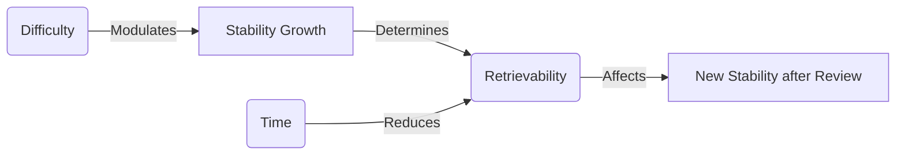

# Cards for understanding the relationship between S, D, R
Created on: 2025-07-12T12:17:07

Here's an optimized approach to learn the memory model diagram using **Image Occlusion** and **concept reinforcement cards**:

### 📊 Image Occlusion Setup
1. **Generate the diagram image** using [Mermaid Live Editor](https://mermaid.live/) with this code:

2. **Create occlusion cards** for each relationship:

| Occlusion Area              | Card Front Question                          |
|-----------------------------|---------------------------------------------|
| "Modulates" arrow           | How does Difficulty affect Stability Growth? |
| "Determines" arrow          | How does Stability relate to Retrievability? |
| "Reduces" arrow             | What effect does Time have?                 |
| "Affects" arrow             | How does Retrievability influence Stability?|
| Entire "R" node             | What does 'R' represent in this model?      |

---

### 🔍 Reinforcement Cards (Non-Image)
#### Card 1: Core Relationships
**Front**:  
Complete the relationships:  
1. Difficulty → ______ → Stability Growth  
2. Stability → ______ → Retrievability  
3. Time → ______ → Retrievability  
4. Retrievability → ______ → Stability Growth  

**Back**:  
1. Modulates  
2. Determines  
3. Reduces  
4. Affects  

#### Card 2: Definition Recall
**Front**:  
What does each arrow mean?  
- "Modulates" = ______  
- "Determines" = ______  
- "Reduces" = ______  
- "Affects" = ______  

**Back**:  
- Modulates = Controls the size of stability gains  
- Determines = Sets the probability of recall  
- Reduces = Decreases over time  
- Affects = Changes future stability growth  

#### Card 3: Real-World Analogy
**Front**:  
In the "water tank" analogy of memory:  
- Stability (S) = ______  
- Retrievability (R) = ______  
- Time (t) = ______  
- Difficulty (D) = ______  

**Back**:  
- S = Tank size  
- R = Current water level  
- t = Time passing  
- D = Rate of leaks  

---

### 💡 Application Cards
#### Card 4: Cause → Effect
**Front**:  
If Difficulty increases from 0.3 → 0.7, what happens to Stability Growth?  
**Back**:  
**It decreases**  
*(Higher D → Smaller stability gains per review)*  

#### Card 5: Parameter Change
**Front**:  
What happens to Retrievability if:  
1. Stability doubles?  
2. Time since last review triples?  

**Back**:  
1. R decreases **slower** (larger tank → slower level drop)  
2. R decreases **faster** (more time → more water loss)  

---

### ⚙️ Pro Tips
1. **Tag all cards** with `#MemoryModelDiagram`
2. **Add diagram to extra field**:
```html
<div style='text-align:center'>

</div>
```
3. **Use consistent color coding**:
   - D: Red
   - S: Blue
   - R: Green
   - t: Gray

### 🔄 Study Sequence
1. Start with **image occlusion cards** to learn diagram layout
2. Proceed to **reinforcement cards** for definitions
3. Finish with **application cards** for deeper understanding
4. Review entire set together after 24 hours

This approach combines visual memory (image occlusion) with conceptual understanding (reinforcement cards) and practical application - perfect for mastering complex diagrams! The water tank analogy serves as a consistent mental model across all cards.

Here's the optimized card strategy for learning the diagram, specifying exactly when to use **Hide All, Guess One** vs. **Hide One, Reveal All** for maximum effectiveness:

### 🎴 Image Occlusion Card Strategy
| **Card Type**          | **Best For**                          | **Diagram Elements**                  | **# Cards** | **Review Focus**              |
|------------------------|---------------------------------------|---------------------------------------|-------------|-------------------------------|
| **Hide One, Reveal All** | Learning relationships & context      | Single arrows/labels                  | 4 cards     | "How do these connect?"       |
| **Hide All, Guess One**  | Testing precise recall of components | Individual nodes (D,S,R,t,S_Growth)  | 5 cards     | "What goes here specifically?" |

---

### 1. **Hide One, Reveal All Cards** (Recommended First)  
**Purpose:** Understand relationships in context  
**Create 4 cards for:**  
- Arrow A: `D -->|Modulates| S`  
- Arrow B: `S -->|Determines| R`  
- Arrow C: `t -->|Reduces| R`  
- Arrow D: `R -->|Affects| S_Growth`  

**Front Example (Arrow A):**  
  
*Question:* "What relationship connects Difficulty and Stability Growth?"  

**Back:**  
  
*Answer:* "D modulates S"  

**Why start here?**  
You see the whole diagram while learning one relationship, building mental connections.

---

### 2. **Hide All, Guess One Cards** (For Precision)  
**Purpose:** Master individual components  
**Create 5 cards for:**  
- Difficulty (D) node  
- Stability Growth (S) node  
- Retrievability (R) node  
- Time (t) node  
- S_Growth node  

**Front Example (R node):**  
  
*Question:* "What memory parameter appears here?"  

**Back:**  
  
*Answer:* "Retrievability (R)"  

---

### 🔄 Reinforcement Card Strategy  
#### Card Type 1: Relationship Recall  
**Front:**  
What effect does Time (t) have on Retrievability (R) in the memory model?  
**Back:**  
**Reduces R**  
*Extra:* Diagram snippet: `t -->|Reduces| R`  

#### Card Type 2: Component Function  
**Front:**  
Which element modulates Stability Growth?  
**Back:**  
**Difficulty (D)**  
*Extra:* `D -->|Modulates| S`  

---

### 🧩 Study Sequence  
1. **Phase 1 (Day 1):**  
   - 4x **Hide One, Reveal All** cards (arrows)  
   - 3x Reinforcement cards (relationships)  

2. **Phase 2 (Day 3):**  
   - 5x **Hide All, Guess One** cards (nodes)  
   - 2x Application cards ("What if D increases?")  

3. **Phase 3 (Day 7):**  
   - Mix all card types  
   - Add analogies ("Water tank: What leaks?")  

---

### 💡 Pro Tips  
1. **Color-code elements** in your diagram:  
   - Red: D  
   - Blue: S  
   - Green: R  
   - Gray: t  
   *Visual consistency speeds recall*

2. **Add tooltips** to image back sides:  
   ```html
   <!-- In Anki image back template -->
   <div class=hint>{{#Modulates}}Controls stability gain size{{/Modulates}}</div>
   ```

3. **Tagging system:**  
   - `#MM:Relationships` for arrow cards  
   - `#MM:Components` for node cards  
   - `#MM:Applied` for reinforcement cards

---

### ⏱️ Expected Results  
| **Card Type**          | Retention Goal | Optimal Interval Growth |
|------------------------|----------------|-------------------------|
| Hide One, Reveal All   | 95%            | Fast (3d → 7d → 21d)    |
| Hide All, Guess One    | 90%            | Medium (2d → 5d → 15d)  |
| Reinforcement Cards    | 85%            | Slow (1d → 3d → 10d)    |

This layered approach ensures you first understand the system's flow (contextual relationships), then drill down to precise component recall - exactly how human memory builds complex schemas!