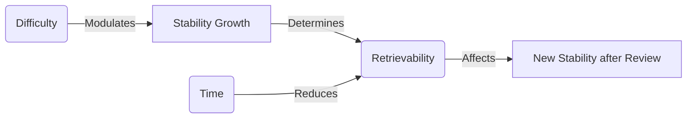

# Stability, Difficulty, Retrievability
Created on: 2025-07-12T10:24:22

### Memory Stability (S), Difficulty (D), and Retrievability (R) Explained  
*(Based on Piotr Wozniak's Two-Component Model & FSRS Algorithm)*  

---

#### 1. **Memory Stability (S)**  
**Definition**:  
*The **durability** of a memory - how long you can retain it without review before forgetting becomes likely.*  

**Simple Explanation**:  
- Measures *how deeply ingrained* a memory is  
- **High S** → Months/years between reviews  
- **Low S** → Hours/days between reviews  

**Formula**:  
```math  
S = days\ until\ 90\%\ recall\ probability  
```  

**Example**:  
- If S = 30 → You'll remember this ~30 days without review  
- After successful recall, S increases (e.g., 30 → 45 days)  

---

#### 2. **Memory Difficulty (D)**  
**Definition**:  
*How **hard** it is to increase a memory's stability through successful recall.*  

**Simple Explanation**:  
- Measures *intrinsic complexity* of the material  
- **High D** (0.8-1.0) → "Hard card" → Small stability gains per review  
- **Low D** (0.1-0.3) → "Easy card" → Large stability gains per review  

**Formula**:  
```math  
\Delta S = f(D) \times Current\ S  
```  
*(Where f(D) is a growth multiplier that shrinks as D increases)*  

**Example**:  
- D=0.2 (easy): Review success → S doubles  
- D=0.9 (hard): Review success → S increases only 10%  

---

#### 3. **Retrievability (R)**  
**Definition**:  
*The **current probability** you can recall a memory right now.*  

**Simple Explanation**:  
- Measures *immediate accessibility*  
- **High R** (0.95) → "Fresh in mind"  
- **Low R** (0.60) → "Fading fast"  

**Formula**:  
```math  
R = e^{-t/S}  
```  
*(t = time since last review)*  

**Example**:  
- Card with S=10 days:  
  - After 5 days: R = e^{-5/10} ≈ 0.60 (60% recall chance)  
  - After 1 day: R = e^{-1/10} ≈ 0.90 (90% recall chance)  

---

### 🧠 How They Work Together  


1. **When you review a card**:  
   - **Success at low R** (e.g., 60%) → **Big S increase**  
   - **Success at high R** (e.g., 95%) → **Small S increase**  
   - **Failure** → **S decreases**  

2. **Difficulty's role**:  
   - High D cards → Need **more reviews** to achieve same S  
   - Low D cards → Achieve high S with **fewer reviews**  

---

### ⚡ Real-World Analogy  
Imagine memory as a **water tank**:  
- **Stability (S)** = Tank size (gallons)  
- **Retrievability (R)** = Current water level (%)  
- **Difficulty (D)** = Rate of leaks (high D = fast leaks)  
- **Reviews** = Adding water:  
  - Big pours when nearly empty (low R)  
  - Small top-ups when nearly full (high R)  

---

### 🔍 FSRS in Anki  
| Parameter | Anki Equivalent | Controls |  
|-----------|-----------------|----------|  
| **S**     | Interval        | When card appears next |  
| **D**     | Ease Factor     | How fast intervals grow |  
| **R**     | Due Alert       | Probability you'll remember |  

**Optimization Goal**:  
Schedule reviews when R ≈ **85-95%** → Maximizes stability gains per review time  

---

### ✅ Summary Card  
**Front**:  
Stability (S) measures ______, Difficulty (D) measures ______, and Retrievability (R) measures ______.  

**Back**:  
> - **S**: Memory durability (days until 90% recall)  
> - **D**: Resistance to stability growth (0=easy, 1=hard)  
> - **R**: Current recall probability (0.0-1.0)  

**Extra**:  
```  
R = e^(-t/S)  # Retrievability formula  
ΔS ∝ 1/D      # Stability growth vs. difficulty  
```  
**Tag**: `#FSRS_CoreConcepts`  

This framework transforms abstract memory science into actionable Anki practices. For deeper understanding, create cards for:  
1. How S changes after successful/failed reviews  
2. Why reviewing at R=90% is optimal  
3. How to reduce D for stubborn cards