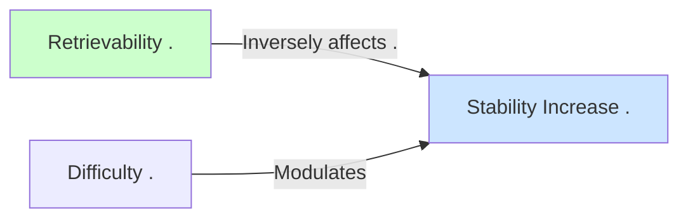

# Water Tank Analogy - amount of water poured corresponds to
Created on: 2025-07-12T23:11:50

In the water tank analogy, the **amount of water added** ("big pours" vs. "small top-ups") correlates directly with the **increase in memory stability (ΔS)** after a review. Here's the precise mapping:

### 💧 Water Analogy ↔ Memory Model
| **Water Tank Action** | **Memory Equivalent**              | **Mechanism**                                                                 |
|------------------------|-----------------------------------|-------------------------------------------------------------------------------|
| **Big Pour**           | Large stability increase (ΔS↑↑)   | Reviewing at **low retrievability (R)** triggers significant synaptic strengthening |
| **Small Top-up**       | Small stability increase (ΔS↑)    | Reviewing at **high retrievability (R)** yields minimal stability gains       |

---

### 🧠 Why This Correlation Exists
1. **Biological Basis**:  
   - **"Big pours"** (low R) → Activate **synaptic reconsolidation pathways** → Stronger memory traces  
   - **"Small top-ups"** (high R) → Engage **maintenance mechanisms** → Minor refinements  

2. **Cognitive Psychology**:  
   ```math
   \Delta S \propto \frac{1}{R} \times \frac{1}{D}
   ```
   - Lower R → Larger ΔS (inverse relationship)  
   - Lower D (easier cards) → Amplifies this effect  

3. **Efficiency Trade-off**:  
   | R Level | Water Added | Stability Gain | Time Efficiency |  
   |---------|-------------|----------------|-----------------|  
   | 30%     | Bucket      | High (ΔS=+80%) | Low             |  
   | 90%     | Cup         | Low (ΔS=+5%)   | High            |  

---

### 🔄 Real Memory Examples
1. **"Big Pour" Scenario** (R=40%):  
   - Card last seen 60 days ago (S=30 days)  
   - Struggle to recall → Success!  
   - **Result**: S jumps to 85 days (ΔS=+183%)  

2. **"Small Top-up" Scenario** (R=92%):  
   - Card last seen 7 days ago (S=90 days)  
   - Instant recall  
   - **Result**: S increases to 94 days (ΔS=+4.4%)  

---

### 🌊 Key Insight Card  
**Front**:  
In the water tank analogy, the amount of water added during review (big pour/small top-up) correlates with ______ in the memory model.  

**Back**:  
**The increase in stability (ΔS)**  
- Big pour → Large ΔS (low R review)  
- Small top-up → Small ΔS (high R review)  

**Extra**:  

*"Pouring water into a leaky tank? Fix leaks first (lower D) to make pours more effective!"*  

---

### ⚠️ Critical Nuance  
The water added **restores retrievability to 100%** in ALL cases, but the **consequent stability growth (ΔS)** depends on:  
1. **How empty the tank was** (R level at review)  
2. **The tank's leak rate** (Difficulty D)  
3. **Construction crew efficiency** (your brain's state)  

This explains why "struggling but succeeding" builds more durable memories than easy recalls!