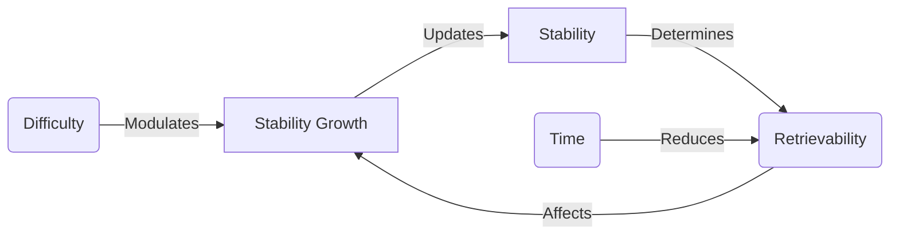
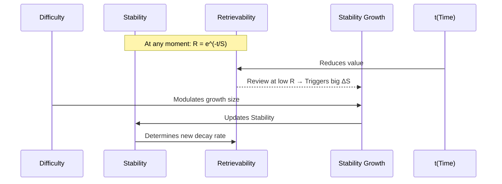
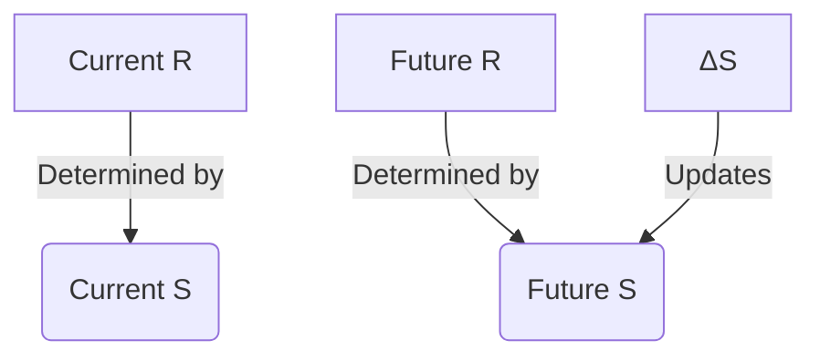

# Stability or Stability Growth - what determines Retrievability
Created on: 2025-07-13T14:08:45

The **second sentence** is fundamentally correct:  
**"Stability determines how likely you are to recall (retrievability)."**  

Here's why, with a clear breakdown:

### 🔍 Key Distinction
| **Concept**          | **Role**                                                                 | **Retrievability Connection**                                                                 |
|----------------------|--------------------------------------------------------------------------|----------------------------------------------------------------------------------------------|
| **Stability (S)**    | Memory *durability* (how long knowledge lasts)                          | **Directly determines R** via: `R = e^(-t/S)`<br>(Higher S = slower R decay over time)       |
| **Stability Growth (ΔS)** | *Change* in durability after review                                | **Indirectly affects *future* R** by increasing S → which *then* improves future retention |

---

### 🧠 Simple Analogy: Phone Battery
- **Stability (S)** = **Battery capacity**  
  - Determines *how long your charge lasts*  
  - *Example:* Big battery (high S) → Stays at 90% for hours → High R over time  

- **Stability Growth (ΔS)** = **Upgrading battery capacity**  
  - Determines *future battery performance*  
  - *Example:* Replacing 2000mAh → 4000mAh battery → *Tomorrow's* charge lasts longer  

---

### ✅ Why "Stability → Retrievability" is Correct
1. **Immediate Relationship**:  
   - At any moment, your recall chance (R) depends *only* on:  
     - Current **Stability (S)**  
     - **Time (t)** since last review  
   - Formula: `R = e^(-t/S)`  

2. **Real Example**:  
   - Card A: S=10 days, reviewed 5 days ago → R=60%  
   - Card B: S=100 days, reviewed 5 days ago → R=95%  
   → *Same time (t), different S → Different R!*  

---

### ⚠️ Why "Stability Growth → Retrievability" is Misleading
- ΔS changes **S**, not current R:  
  ```mermaid
  graph LR
    ΔS[Stability Growth] -->|impacts| S[ Stability]
    S -->|determines| R_Future[Future Retrievability]
    S -->|determines| R_Current[Current Retrievability]
  ```
- After review:  
  - ΔS increases S → *Next interval* improves  
  - But your **current R is already 100%** (you just recalled it!)  

---

### 💡 Ultimate Insight Card  
**Front**:  
True or False: Stability (S) directly determines your current probability of recall (R).  
**Back**:  
**True**  
- Formula: `R = e^(-t/S)`  
- Higher S = slower R decay over time  

**Extra**:  
> Stability Growth (ΔS) only affects *future* R by increasing S.  

### 🔄 Cause-Effect Card  
**Front**:  
If two cards were last reviewed 10 days ago:  
- Card X: S=10 days  
- Card Y: S=30 days  
Which has higher retrievability (R) today?  
**Back**:  
**Card Y**  
- R_X = e^(-10/10) ≈ 37%  
- R_Y = e^(-10/30) ≈ 72%  

**Tag**: `#MemoryScience`  

This clarifies the causal chain:  
**Reviews → ΔS → Future S → Future R**  
*(Your current R is governed solely by current S and time!)*


## Revised Memory Model diagram

Here's the **corrected diagram** based on precise memory science principles, with explanations for each change:



### 🔧 Key Corrections & Why:
1. **Added Stability (S) as a core node**:  
   - ✨ **New**: Explicit Stability (S) node  
   - 🚫 **Removed**: Direct "Stability Growth → Retrievability" link  
   - ✅ **Why**: Retrievability is determined *solely* by current Stability (S) and time via `R = e^(-t/S)`  

2. **Clarified Stability Growth (ΔS) role**:  
   - ✨ **New**: "ΔS → Updates → S" relationship  
   - ✅ **Why**: Stability Growth *changes future Stability* but doesn't directly control current Retrievability  

3. **Refined feedback loop**:  
   - ✨ **New**: "R → Affects → ΔS" connection  
   - ✅ **Why**: Retrievability at review time *influences how much Stability grows* (low R → bigger ΔS)  

---

### 🔄 How the Corrected System Works


### 💡 Key Relationships Explained
| **Relationship**              | **Real-World Analogy**                  | **Cognitive Basis**                     |
|-------------------------------|----------------------------------------|----------------------------------------|
| **S → Determines → R**        | Bigger battery → Longer charge lasts   | Forgetting curve: `R = e^(-t/S)`       |
| **R → Affects → ΔS**          | Empty battery → Bigger capacity upgrade| Bjork's desirable difficulty           |
| **ΔS → Updates → S**          | Installation → New battery capacity    | Synaptic consolidation (Dudai, 2012)   |
| **D → Modulates → ΔS**        | Leaky tank → Harder to upgrade         | Item-specific difficulty (FSRS model)  |

---

### ❌ Original Diagram Issues Fixed
1. **Missing Stability State**:  
   Original treated "Stability Growth" as a static property rather than a *change process*  

2. **Incorrect Causality**:  
   Stability Growth (ΔS) affects *future* R through S, not current R  

3. **Omitted Feedback**:  
   Failed to show how current R influences future growth (critical for scheduling)  

---

### ✅ Ultimate Insight Card  
**Front**:  
In the memory model, ______ directly determines current retrievability (R), while ______ updates it for the future.  

**Back**:  
**Stability (S) ; Stability Growth (ΔS)**  
- S → Controls R via forgetting curve  
- ΔS → Changes S → Affects *future* R  
**Extra**:  


This corrected diagram reflects the true causal chain:  
**Review event → ΔS (influenced by D and R) → New S → Future R**  
*(Your current recall probability is always governed by existing stability and time!)*