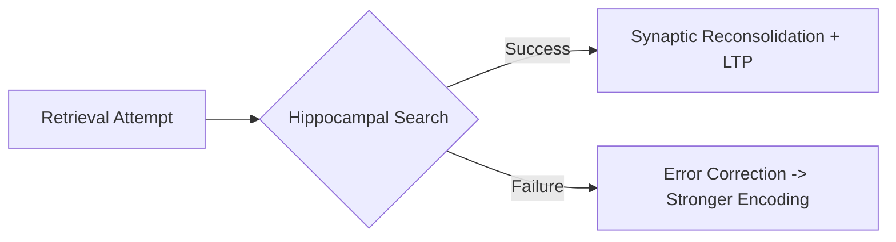

# Physiology of Active Recall vs Passive reviewing
Created on: 2025-07-17T11:44:19

Can you explain the physiology behind 'active stimulation of memory by active recall being more effective than passive reading' in simple but precise terms?

Here's a concise physiological explanation of why **active recall** outperforms passive reading, based on synaptic plasticity and brain systems:

### 🧠 Core Mechanism: **Synaptic Reconsolidation**
When you **actively recall** information:
1. **Hippocampus** reconstructs memory from cortical fragments  
2. **Prefrontal cortex** effortfully resolves mismatches ("desirable difficulty")  
3. **Synapses** enter a *labile state* → Enable **protein synthesis** (new NMDA/AMPA receptors)  
4. **Memory trace** physically strengthens via **long-term potentiation (LTP)**  

*Passive reading only activates shallow sensory pathways without this reconsolidation cycle.*

---

### ⚡️ Key Physiological Drivers  
| **Factor**               | **Active Recall**                     | **Passive Reading**          |  
|--------------------------|---------------------------------------|------------------------------|  
| **Hippocampal Engagement**| High (pattern completion)             | Low                          |  
| **Dopamine Release**     | Surges upon *successful retrieval*    | Minimal                      |  
| **BDNF Production**      | Upregulated (stimulates neurogenesis) | Unchanged                    |  
| **Cortical Reorganization**| Strengthens *retrieval pathways*      | Fades quickly (no deep trace)|  

---

### 🌰 Real-World Example: Learning "Mitochondria = Powerhouse"  
#### Passive Reading:  
- Visual cortex → Temporal lobe (temporary storage)  
- **Result**: Fades in ~48 hours (no protein synthesis)  

#### Active Recall:  
1. Attempt retrieval: "What cell organelle produces ATP?"  
2. Hippocampal-cortical loop activates  
3. Upon recall:  
   - **Dopamine** tags memory as important  
   - **NMDA receptors** trigger Ca²⁺ influx → **CREB phosphorylation**  
   - **New dendritic spines** form in prefrontal cortex  
4. **Result**: LTP creates lasting cortical embedding  

---

### 💡 Why This Matters  
**Active recall forces "deep processing"**:  

Whereas passive reading only engages:  
`Visual Input → Temporary Sensory Buffers → Rapid Decay`

---

### ✅ Summary Card  
**Front**:  
Active recall strengthens memories physiologically by triggering ______ and ______.  

**Back**:  
**synaptic reconsolidation ; long-term potentiation (LTP)**  
*Requires hippocampal engagement and protein synthesis*  

**Extra**:  
> Key molecules:  
> - **NMDA/AMPA receptors** (LTP execution)  
> - **BDNF** (synapse growth)  
> - **Dopamine** (priority tagging)  

---

### ⏱️ Time Efficiency  
| Method          | Retention after 1 Week | Neural Effort |  
|-----------------|-------------------------|---------------|  
| Passive Reading | 10-20%                  | Low           |  
| Active Recall   | 70-80%                  | High (but optimal) |  

*High neural effort = High durability gains (Bjork's "desirable difficulty")*

---

### 🚀 Practical Implication  
**Anki works because it forces active recall** - each card flip triggers:  
1. Hippocampal pattern completion  
2. Dopamine-mediated consolidation upon success  
3. Synaptic remodeling during sleep  

Passive reading is like *watching* someone exercise; active recall is *lifting the weights yourself*. The struggle builds lasting memory "muscle" at a physiological level.